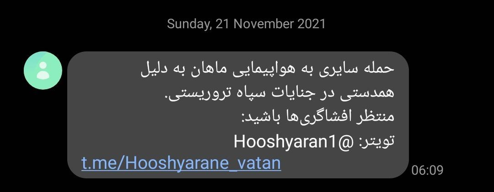
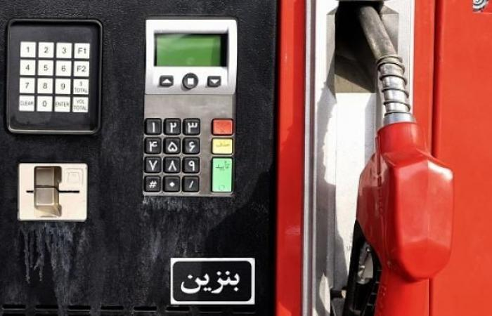
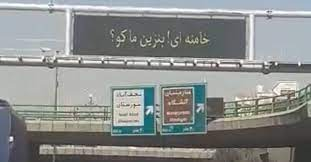
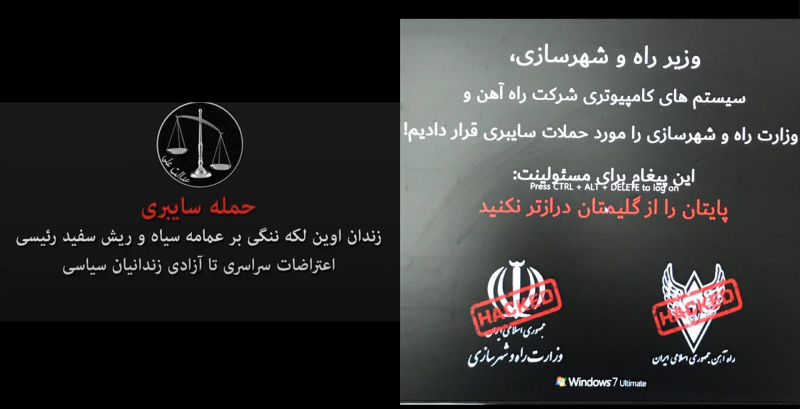
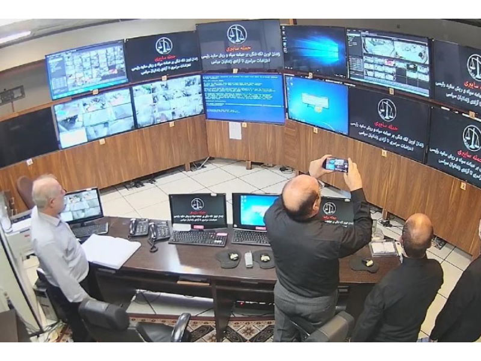

# cyber attacks in iran
A curated list of awesome cyber attacks in iran, we want to review and explain some advanced attack that happened in iran, in order to learned some security tips.

### [Iran's Mahan Air](https://www.mahan.aero/) 
* attack explain : Iranian airline Mahan Air was hit by a cyberattack on Sunday morning 2021/11/21, the “Hooshyarane Vatan” hacker group claimed responsibility for the attack.
* attack Type :
  *  in 2020 this site hacked with sql injection attack then leaked 5000 documents.
  *  in 2021 CMS and customer club and mail server and sms reseller was hacked, There is no further information on the type of attack.

  

### Shutting Down Smart Gas Stations
* attack explain : The attack disabled a system that allows consumers to buy subsidized fuel with government-issued electronic cards.
* attack Type :
  * PT(petrol terminal) is so old and bought 14 years ago
  * hardware was not compatible with PCI DSS
  * weak encription was used in connection betwean IPC to spooler
  * used insider employe for uploaded malicious RPM package in all IPC
  * some data is secrect and i can not say

  

### Hacking Isfahan city traffic signs
* attack explain : hacked electronic signs that read “Khamenei, where is our gasoline?” Others hacked signs reportedly showed “Free gas in Jamaran gas station.”
* attack Type :
  * using gas station backup node datacenter for storing signs data!
  * used mikrotik device at edge that vulnerable and not updated

  

### iran’s transport ministry and railways
* attack explain : Train services had been disrupted on Friday, with hackers posting fake delay notices on station boards.
* attack Type :
  * weakness in IIS portal for initial access
  * used trojan-win32-breakwin malware for destroy all data

  

### leaked footage Evin Prison
* attack explain : A hacktivist group going by the name of Adalat Ali (Ali’s Justice) has breached the internal CCTV system at Evin
* attack Type :
  * Air-Gap Attack
  * used insider employee for stol video
  * used eternal blue  bug and smb bug

  

